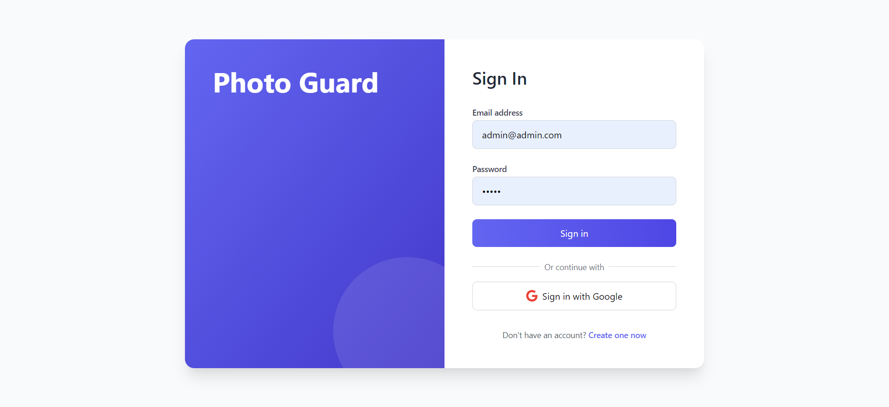
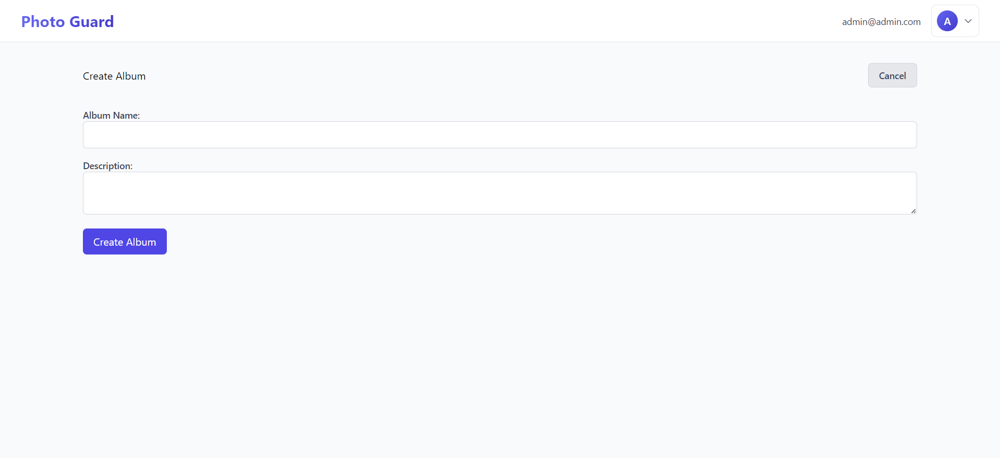
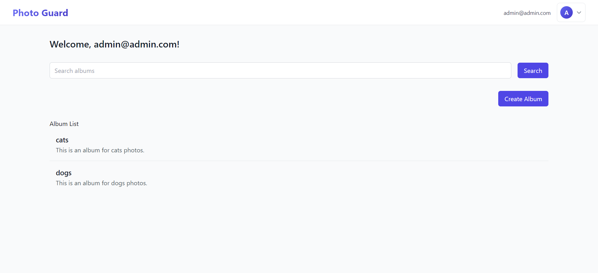
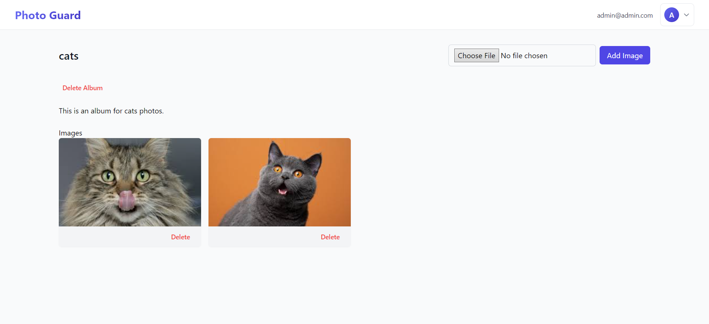
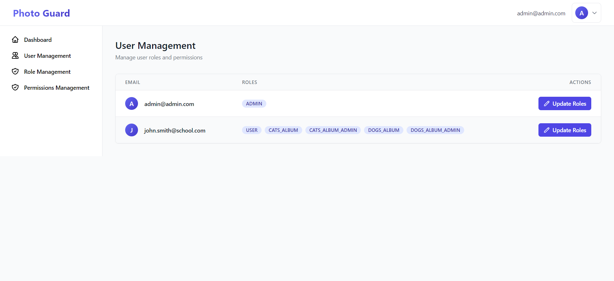
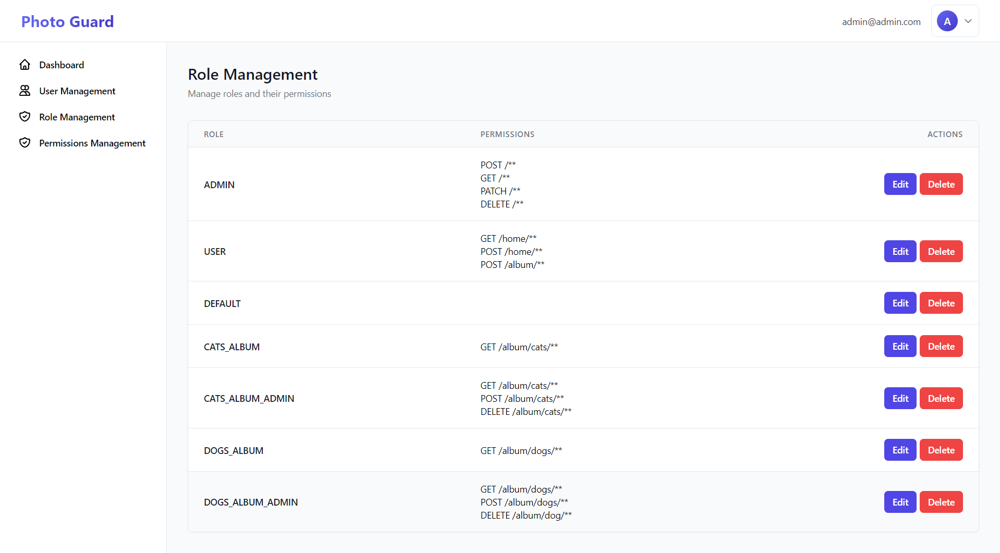
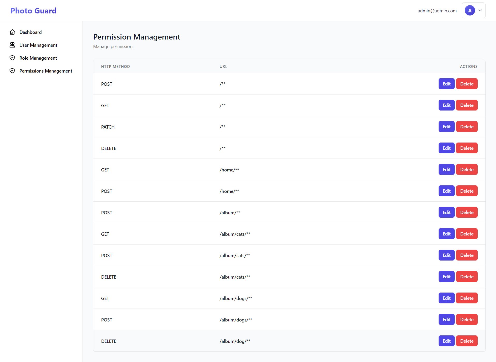

# Photo Guard - Role-Based Photo Album Management Platform

## Overview

Photo Guard is a Spring Boot web application designed for secure and role-based management of photo albums.  Users can create accounts, log in, and manage their photo albums, while administrators have fine-grained control over user roles and access permissions. Built upon a base project that provided core user authentication and security infrastructure, Photo Guard extends these foundations to implement a robust and feature-rich photo album platform.

**Key Features:**

* **User Account Management:** Users can create accounts and securely log in to the application. (Base project functionality, extended in this project)
* **Role-Based Access Control (RBAC):**  Granular control over user actions based on roles and permissions. Users are granted access to albums and functionalities based on assigned roles.
* **Dynamic Role Creation:** When a new photo album is created, two roles are automatically generated: `<ALBUM NAME>_ALBUM_ADMIN` (for album administrators) and `<ALBUM NAME>_ALBUM` (for album viewers). The user that created the album gets the album admin role.
* **Album Management:** Users can create photo albums with descriptions, add images to albums, and delete albums and associated images.
* **Image Management:** Album administrators can add and delete images within their albums.
* **Album Search:**  Users can search for albums by name from the homepage.
* **Permission Management:** A super administrator can manage roles, permissions (endpoints), and assign roles to users. This includes:
    * Adding and deleting roles and permissions.
    * Modifying permissions associated with roles.
    * Assigning and revoking roles for individual users.
    * Managing available application endpoints ("permissions").
* **Secure Endpoints:**  Spring Security is leveraged to protect endpoints, ensuring that only users with the necessary roles and permissions can access specific functionalities.
* **Styled with Bootstrap & Thymeleaf:**  Utilizes Bootstrap for a responsive and user-friendly frontend and Thymeleaf for dynamic HTML templating.
* **PostgreSQL Database:**  Employs PostgreSQL for persistent data storage of user accounts, roles, permissions, albums, and images.

## Features Breakdown

### User Features (Album Creators & Viewers)

* **Account Creation & Login:** Users can register for an account and securely log in using email and password.
* **Album Creation:** Logged-in users can create new photo albums, providing a name and description.
* **Album Deletion:** Users can delete albums they have created, which also removes all associated images.
* **Image Upload (Album Admins):** Users with the `<ALBUM NAME>_ALBUM_ADMIN` role can upload images to their albums.
* **Image Deletion (Album Admins):** Users with the `<ALBUM NAME>_ALBUM_ADMIN` role can delete images from their albums.
* **Album Viewing (Authorized Users):** Users with the `<ALBUM NAME>_ALBUM` role (or `<ALBUM NAME>_ALBUM_ADMIN`) can view the images within an album they have access to.
* **Album Search (Homepage):** The users can search for publicly accessible albums by name using a search bar on the homepage.

### Administrator Features (Super Admin Role)

* **User Role Management:**
    * View and manage existing user roles.
    * Add new roles to the system.
    * Delete existing roles.
    * Assign roles to users.
    * Revoke roles from users.
* **Permission (Endpoint) Management:**
    * View and manage existing permissions (endpoints) in the application.
    * Add new permissions (endpoints).
    * Delete existing permissions.
* **Role-Permission Association:**
    * Modify the permissions associated with each role, granting or revoking access to specific functionalities.
* **User Role Modification:**  Modify the roles assigned to individual users, granting or restricting their access within the application.

## Technologies Used

* **Backend:**
    * **Spring Boot:** (Java framework for building the application)
    * **Spring Security:** (For security and role-based access control)
    * **Java:** (Programming Language)
* **Frontend:**
    * **Thymeleaf:** (Template engine for dynamic HTML)
    * **Bootstrap:** (CSS framework for responsive styling)
    * **HTML, CSS, JavaScript**
* **Database:**
    * **PostgreSQL:** (Relational database for persistent data storage)

## Setup and Installation

To run Photo Guard locally, please follow these steps:

1. **Prerequisites:**
    * **Java Development Kit (JDK):** Ensure you have JDK installed.
    * **PostgreSQL Database:**  Install and set up a PostgreSQL database instance. You will need *two* PostgreSQL databases for this application as indicated in the `application.properties` configuration.

2. **Database Setup:**
    * **Create Databases:** Create *two* new PostgreSQL databases.

3. **Configuration:**
    * **Create `application.properties` file:**  In your project's `src/main/resources` directory, create a file named `application.properties`.
    * **Populate `application.properties`:** Copy the following content into your newly created `application.properties` file.

      ```properties
      spring.application.name=PHOTO_GUARD
      server.port=8080

      # Primary DataSource (PostgreSQL 1)
      spring.datasource.primary.url=jdbc:postgresql://localhost:5432/[Your Primary Database Name]
      spring.datasource.primary.username=[Your Primary Database Username]
      spring.datasource.primary.password=[Your Primary Database Password]
      spring.datasource.primary.driver-class-name=org.postgresql.Driver
      spring.datasource.primary.jpa.hibernate.ddl-auto=update
      spring.datasource.primary.jpa.properties.hibernate.dialect=org.hibernate.dialect.PostgreSQLDialect

      # Secondary DataSource (PostgreSQL 2)
      spring.datasource.secondary.url=jdbc:postgresql://localhost:5432/[Your Secondary Database]
      spring.datasource.secondary.username=[Your Secondary Database Username]
      spring.datasource.secondary.password=[Your Secondary Database Password]
      spring.datasource.secondary.driver-class-name=org.postgresql.Driver
      spring.datasource.secondary.jpa.hibernate.ddl-auto=update
      spring.datasource.secondary.jpa.properties.hibernate.dialect=org.hibernate.dialect.PostgreSQLDialect

      # DB setup
      spring.jpa.hibernate.ddl-auto=create
      spring.jpa.generate-ddl=true

      # oAuth2 Credentials (Google OAuth - Optional, configure if you want to use Google Login)
      spring.security.oauth2.client.registration.google.client-id=[Your Google OAuth Client ID]
      spring.security.oauth2.client.registration.google.client-secret=[Your Google OAuth Client Secret]
      spring.security.oauth2.client.registration.google.scope=openid,profile,email
      spring.security.oauth2.client.registration.google.redirect-uri=http://localhost:8080/login/oauth2/code/google
      spring.security.oauth2.client.registration.google.client-name=google

      spring.security.oauth2.client.provider.google.authorization-uri=https://accounts.google.com/o/oauth2/v2/auth
      spring.security.oauth2.client.provider.google.token-uri=https://oauth2.googleapis.com/token
      spring.security.oauth2.client.provider.google.user-info-uri=https://openidconnect.googleapis.com/v1/userinfo


      logging.level.org.springframework.security=DEBUG
      logging.level.com.example.rest_api=INFO
      logging.level.com.example.rest_api.service.UserService=DEBUG

      #Is needed for the validation system
      spring.messages.basename=validation
      ```

4. **Build and Run the Application**

5. **Access the Application:**
    * Open your web browser and navigate to: `http://localhost:8080` (or the port you configured in `application.properties`).

## Usage

**Login/Registration:**

1. Open Photo Guard in your browser.
2. You will see a login page. New users can register for an account using the "Register" option.

   
   _Screenshot of the Login/Registration Page_

**Album Management (User Role):**

1. **Create Album:** After logging in, users can navigate to the "Albums" page (or similar) and create new albums by clicking "Create Album" (or similar button).

   
   _Screenshot of the Album Creation Form_

2. **View Albums:** Users can view a list of albums on the homepage or albums page.

   

3. **Access Album (if authorized):** Click on an album to view its details and images (if you have the necessary role).

   

**Admin Panel (Super Admin Role):**

1. **User Management:** Assign/revoke roles for the users.

   

2. **User Role Management:** Manage user roles (view, add, delete, assign/revoke).

   

3. **Permission Management:** Manage permissions (endpoints) (view, add, delete, modify role permissions).

   

## Challenges and Learnings

Building Photo Guard, even upon a pre-existing security foundation, provided valuable learning experiences:

* **Role-Based Access Control Implementation:**  Designing and implementing a dynamic RBAC system, including creating roles on-the-fly when albums are created and managing role-permission associations, deepened my understanding of security principles in web applications.
* **Spring Security Customization:**  Extending and customizing the base project's Spring Security configuration to enforce fine-grained access control based on dynamically created roles and permissions provided practical experience with Spring Security.
* **Database Design for RBAC:**  Designing the database schema to efficiently store and manage users, roles, permissions, and their relationships was crucial for the functionality of Photo Guard.
* **Thymeleaf Templating and Bootstrap Styling:**  Working with Thymeleaf for dynamic content rendering and Bootstrap for responsive UI design enhanced my frontend development skills within the Spring Boot ecosystem.
* **Building upon Existing Codebase:**  Learning to understand, extend, and integrate new features into a pre-existing codebase, including a complex security layer, is a valuable skill in software development.